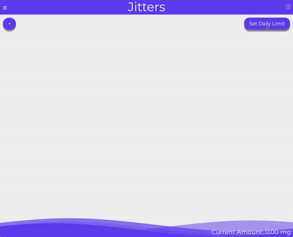
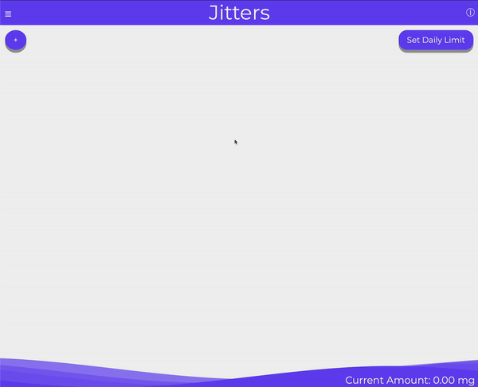

# Jitters
### A caffeine management tool for everyone

## Live Deployment
http://presleyoreed.com/jitters/

## Description
Jitters is an online JavaScript project created for educational puproses at App Academy. The core idea behind the project is a caffeine tracking application focused on one's individual caffeine intake. 

The majority of this project will be constructed with JavaScript. Along the backend there will be some SQL as well as some Ruby to help manage the database of caffeinated items as well as user data and interaction.

## Functionallity and MVPs

In Jitters, users will be able to:

- Input caffeinated items into a daily tracker
- Persist data until the page is reloaded
- See caffeine measurements for a wide range of caffeinated drinks
- List of drinks consumed as you go through the day
- Adjust wave level as you add in drinks or update your caffeine limit for the session

In addition, this project will include: 

- A production README.md
- Sketches and layouts of site

## Use Examples
### Low Wave Example

### High Wave Example

## Wireframes

### Default Color Scheme
This will be the base color for the application with a bonus option to select from a number of color options (You can find the current hopeful options in teh bonus section).

### Main View
Main view of the website once logged in and showing varying levels of caffeine

### Set Daily Limit
An area to manage your settings and preferences


## Technologies and APIs

- Caffeine Informer: https://www.caffeineinformer.com


## Implementation Timeline

- **Thursday 12/30:** Finish the readme and ensure that website loads when running index.html. Finalize API and assemble any back end DB for said API
- **Weekend (12/31-1/2):** Fill out my database and ensure that I have the appropriate ways to access data for my front end view
- **Monday 1/3:** Daily dose of Jitters popup with random fact and timer for when it refreshes
- **Tuesday 1/4:** Side bar with options for what you ard drinking and the amounts
- **Wednesday 1/5:** Sin wave to show the level of caffeine throughout the day and a side measurement ticks to indicate overall caffeine levels in mg
- **Thursday 1/6:** Final polishing and ensuring that all visuals have parity

## Future Features
### Color Schemes
The option to pick amongs these set of color schemes


### Edit Inputs
The ability to edit drinks once the they have been inputed

### Custom Inputs
The option to have a custom input for the drink name, ozs and the mg/oz of that drink

### Export Daily Measurements
The ability to click a button to export your caffeine intake and history for the day for those who wish to keep more detailed records of their caffeine day over day.

## Challenges Along the Way
- The greatest challenge of this application was the lack of a conhesive and comprehensive caffeine measurements for all drinks that exist on the market. Not only do they vary wildly product to product but many are not required to list the precise amount of caffeine which meant I had to compile my own data and compose them into a .json file to use in this project. 
- The wave behavior was a great challenge. While I found some guides on how to generate the waves to look the way they should growning them required some math in regards to the page size and the relative height of the line set at any screen dimenstion. Overall this was an awesome challenge and I really liked sitting down with paper and drawing it out to figure out the best way to lay things out to ensure that there was consistancy and that it looked nice for all view sizes. 
```js 
	// Code that does the measurements to determine the wave height
	let finalMgCount = ozs * mgPerOz;
	let waveRaiseAmount = (finalMgCount/limitMg);
	// This percentage is calculated out of 75% as opposed to 100% as it is off of the line
	// which is fixed to 75% of the height of the screen
	let percentage = Math.floor(waveRaiseAmount * .75 * 100);
	// I had to pass the current mg to the html element so that the counter element could
	// read it properly when there is an update
	let waveElement = document.querySelector("#wave-div");
	let currentCount = waveElement.dataset.currentMg
```
