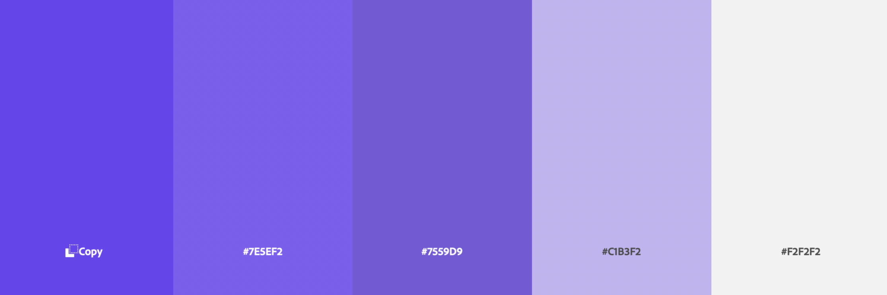
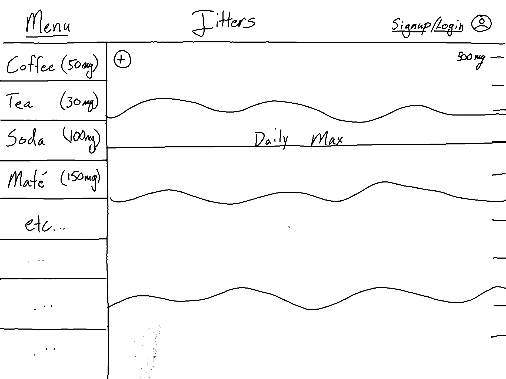
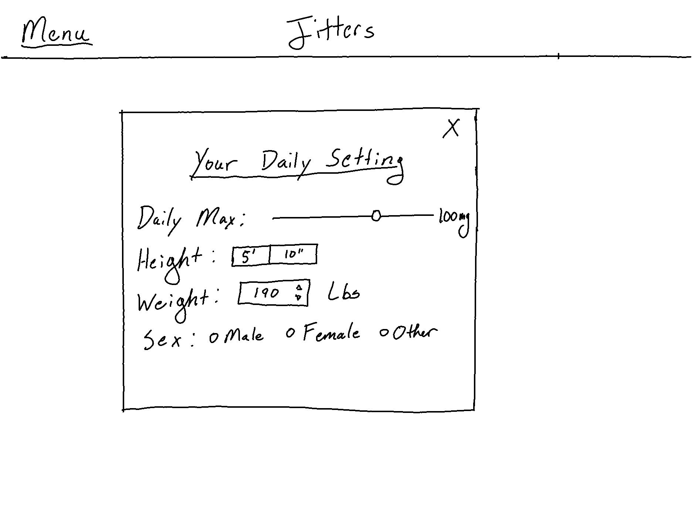
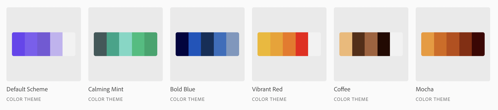

# Jitters
### A caffeine management tool for everyone

## Description
Jitters is an online JavaScript project created for educational puproses at App Academy. The core idea behind the project is a caffeine tracking application focused on one's individual caffeine intake. 

The majority of this project will be constructed with JavaScript. Along the backend there will be some SQL as well as some Ruby to help manage the database of caffeinated items as well as user data and interaction.

## Functionallity and MVPs

In Jitters, users will be able to:

- Input caffeinated items into a daily tracker
- Persist data for one day that is set at the first load of the page
- See caffeine measurements for a wide range of caffeinated drinks
- List of drinks consumed as you go through the day

In addition, this project will include: 

- A production README.md
- Sketches and layouts of site

## Wireframes

### Default Color Scheme
This will be the base color for the application with a bonus option to select from a number of color options (You can find the current hopeful options in teh bonus section).

### Main View
Main view of the website once logged in and showing varying levels of caffeine

### Settings
An area to manage your settings and preferences

## Technologies and APIs

- Caffeine Informer: https://www.caffeineinformer.com

## Implementation Timeline

- **Thursday 12/30:** Finish the readme and ensure that website loads when running index.html. Finalize API and assemble any back end DB for said API
- **Weekend (12/31-1/2):** Fill out my database and ensure that I have the appropriate ways to access data for my front end view
- **Monday 1/3:** Daily dose of Jitters popup with random fact and timer for when it refreshes
- **Tuesday 1/4:** Side bar with options for what you ard drinking and the amounts
- **Wednesday 1/5:** Sin wave to show the level of caffeine throughout the day and a side measurement ticks to indicate overall caffeine levels in mg
- **Thursday 1/6:** Final polishing and ensuring that all visuals have parity

## Bonus Features
### Color Schemes
The option to pick amongs these set of color schemes.

### Export Daily Measurements
The ability to click a button to export your caffeine intake and history for the day for those who wish to keep more detailed records of their caffeine day over day.

